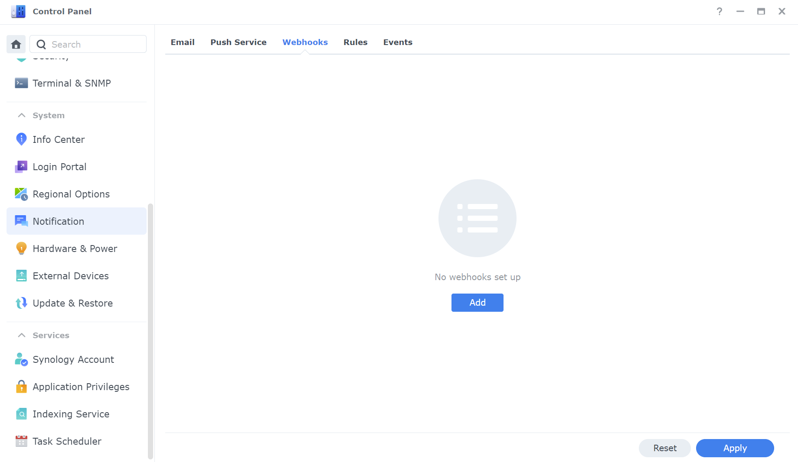
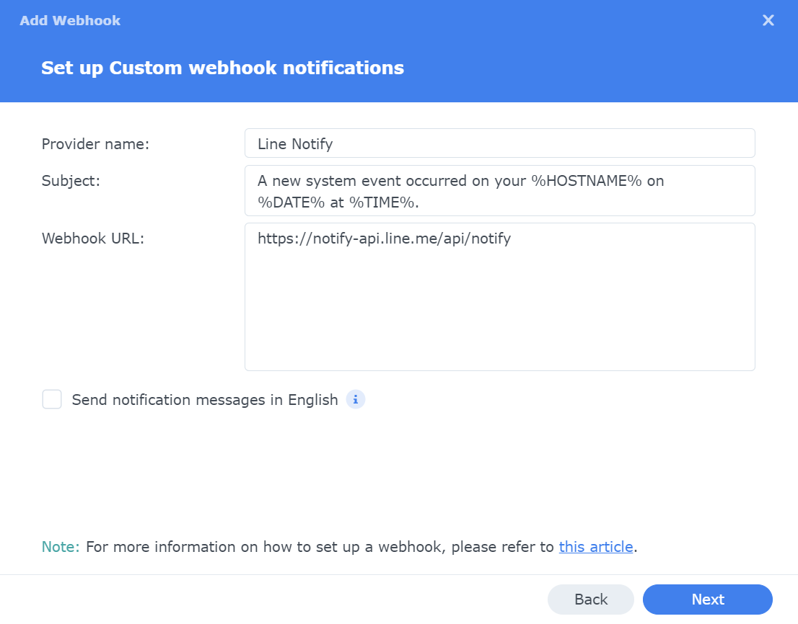
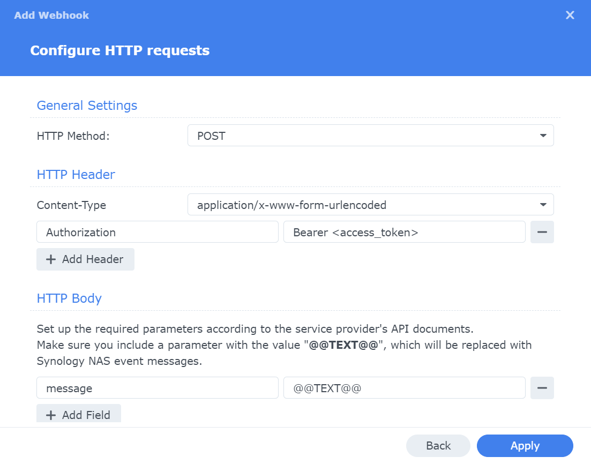
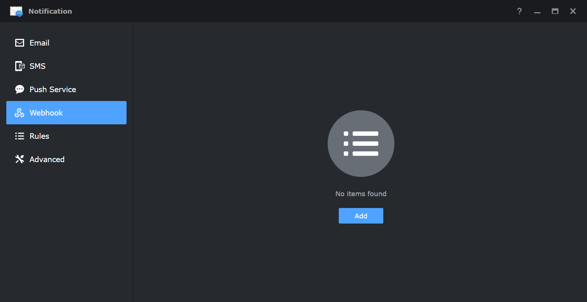
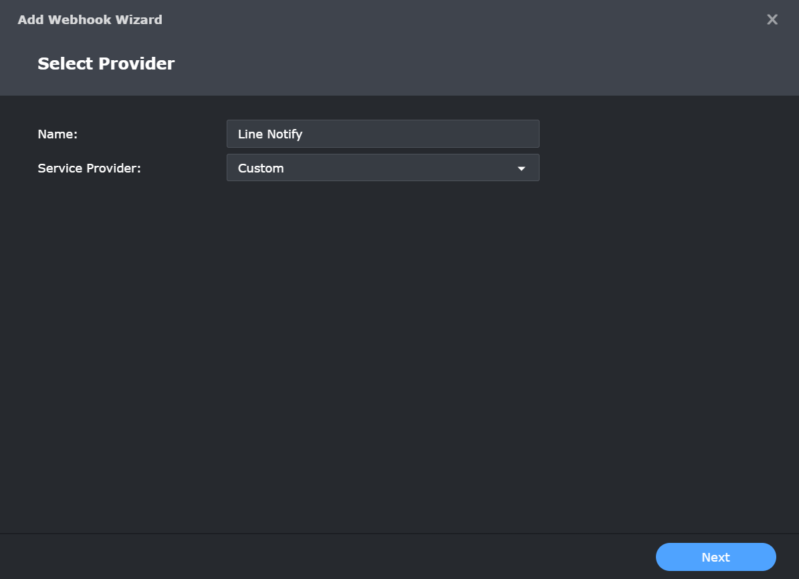
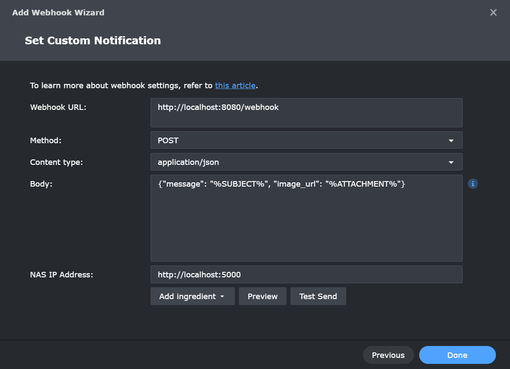
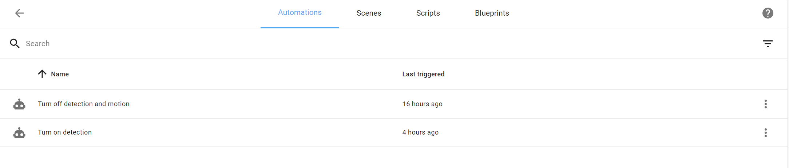
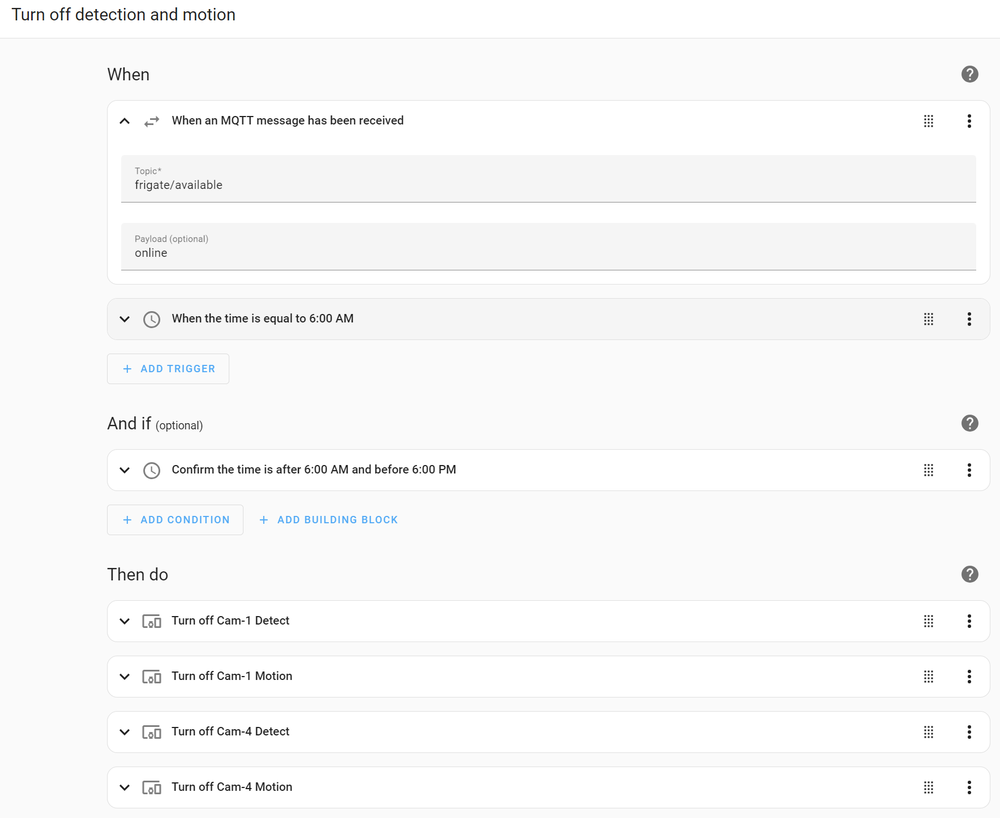
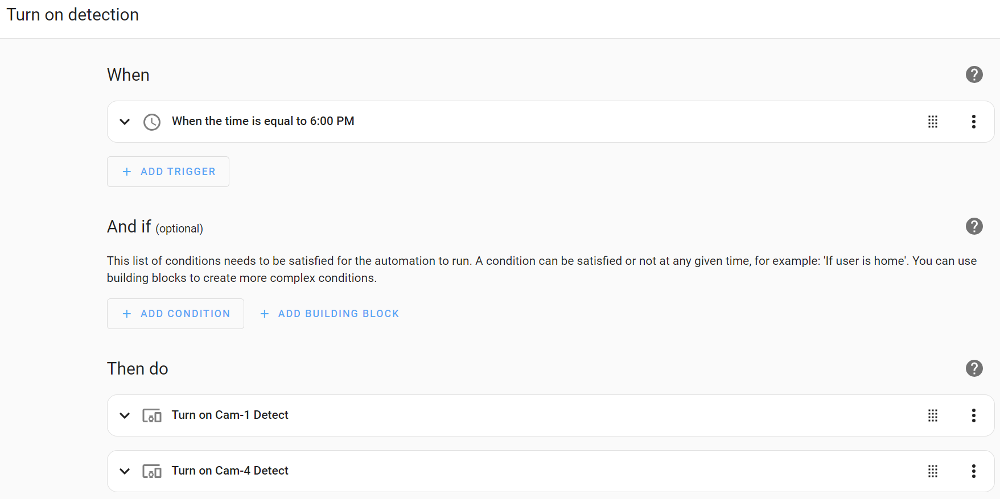

# nvr-notify

[Line Notify](https://notify-bot.line.me/) for [Frigate NVR](https://github.com/blakeblackshear/frigate) and [Synology Surveillance Station](https://www.synology.com/en-global/surveillance)

## Generate Line Notify Token

1. Go to [Line Notify](https://notify-bot.line.me/my/) and log in with your Line account.
2. Click **Generate Token**.
3. Select the group or chat you want to send notifications to and click **Generate Token**.
4. Copy the generated token.
5. Replace the `LINE_NOTIFY_TOKENS` in the **compose-synology.yaml** and **compose-frigate.yaml** files.

## Synology DSM Line Notify

1. Open **Control Panel**, select **Notification**, click **Webhook**, and click **Add**.
2. Select **Custom** from the **Provider** drop-down list, and Select a rule from the **Rule** drop-down list.
3. Specify the **Provider name**. This helps you distinguish this webhook from others.
4. Fill in the **Webhook URL** field with `https://notify-api.line.me/api/notify`.
5. Click **Next**.
6. Select **POST** from the **HTTP Method** drop-down meun.
7. Select **application/x-www-form-urlencoded** from the **Content-Type** drop-down list.
8. Click **Add Header**, and fill in the **Parameter** and **Value** fields with `Authorization` and `Bearer YOUR_LINE_NOTIFY_TOKEN` respectively.
9. Click **Apply**.
10. After you have finished setting up, click on the webhook in the list to edit or remove it. You can also click **Send Test Message** to check that your settings are correct.






## Synology Surveillance Station

### Install nvr-notify

1. Replace the `LINE_NOTIFY_TOKENS` with your Line Notify tokens in the **compose-synology.yaml** file.
2. Open **Container Manager** in DSM, select **Project**, click **Create**, and upload the **compose-synology.yaml** file.

### Synology Surveillance Station Webhook Configuration

1. Open **Notification**, select **Webhook**, click **Add**, and select **Custom** as the Service Provider.
2. Fill in the required fields
    - Webhook URL: `http://localhost:8080/webhook`
    - Method: `POST`
    - Content type: `application/json`
    - Body: `{"message": "%SUBJECT%", "image_url": "%ATTACHMENT%"}`
    - Nas IP Address: `http://localhost:5000`
3. Click **Test Send** to verify the configuration.







## Frigate NVR

1. Install Ubuntu, and create a user named `user` with sudo privileges.
2. Run the following commands.

	```bash
	echo 'user ALL=(ALL:ALL) NOPASSWD:ALL' | sudo tee /etc/sudoers.d/user # Replace user with your username
	
	sudo apt update && sudo apt upgrade -y
	sudo apt install openssh-server git htop neofetch intel-gpu-tools python3-venv -y
	sudo snap install docker && sudo snap install nvim --classic
	
	mkdir nvr-notify && cd nvr-notify/
	mkdir -p frigate/{config,storage,models} hass mosquitto/config

	# Copy frigate/models to frigate/models, and copy mosquitto/config/mosquitto.conf to mosquitto/config/mosquitto.conf, and copy compose-frigate.yaml to compose.yaml
	git clone https://github.com/cyanyux/nvr-notify.git
	cp -r nvr-notify/frigate/models frigate/
	cp nvr-notify/mosquitto/config/mosquitto.conf mosquitto/config/mosquitto.conf
	cp nvr-notify/compose-frigate.yaml compose.yaml
	rm -rf nvr-notify/
	```

3. Create your config.yaml file in the **frigate/config** directory.
4. Replace the `LINE_NOTIFY_TOKENS` with your Line Notify tokens in the **compose.yaml** file, and modify **compose.yaml** to suit your needs.
5. Run `sudo docker compose up`, and check the logs to verify that everything is working, and then press `Ctrl+C` to stop the container.
6. Run `sudo docker compose up -d` to start the container in the background.
7. Open the browser and go to `http://<IP>:5000` to verify that the Frigate NVR is working.

### Confige Frigate NVR

- **Important:** Setup up at least one zone for each camera.
**Note:** `Save` in zone creator will broke the config file format (0.13.2), so we need to fix it manually.

### Configure Home Assistant

If you want to schedule turning on and off detection and motion, you should configure Home Assistant.

1. [Home Assistant Integration](https://docs.frigate.video/integrations/home-assistant)
2. Crate Automation, **Settings > Automations & scenes > CREATE AUTOMATION**







### How to export YOLOv8 model to OpenVINO

**Note:** Because frigate 0.13.2 use openvino 2022.3.1, so we can't use the official yolov8 exported model. We need to export the model with openvino 2022.3.* on a Ubuntu 22.04 machine.

1. Run the following commands.

	```bash
	python3 -m venv venv
	source venv/bin/activate
	python -m pip install --upgrade pip setuptools
	python -m pip install ultralytics openvino-dev[ONNX]==2022.3.*

	yolo export model=yolov8s.pt format=onnx imgsz=320
	mo --input_model yolov8s.onnx -s 255 --compress_to_fp16 --input_shape [1,3,320,320]
	```

#### References

- [Convert YOLOv8 to OpenVino for Frigate.ipynb - Colaboratory (google.com)](https://colab.research.google.com/drive/1G05mESOhDdM1HpinKMJZWpI_jxNq_qIO?usp=sharing)
- [[Support]: OpenVINO Does not work with YOLOX model · Issue #5184 · blakeblackshear/frigate (github.com)](https://github.com/blakeblackshear/frigate/issues/5184#issuecomment-1449314504)
- [[Detector Support]: OpenVINO not running yolo model · Issue #6300 · blakeblackshear/frigate (github.com)](https://github.com/blakeblackshear/frigate/issues/6300)